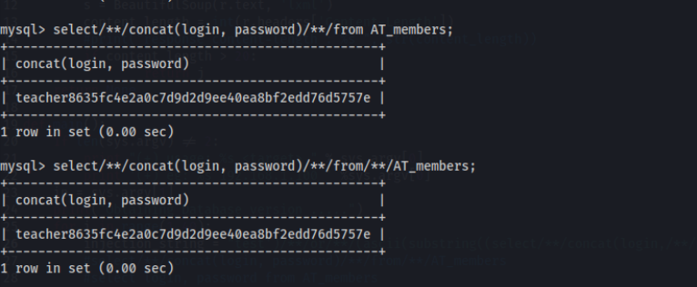

# SQLi_blind
There are a couple of sql injection blind types:

    - Time based
    - Boolean based

The SQLinjection scripts type of this repo are boolean based type.
The script evaluate the response of the target web server in order to obtain if the inferred data is true or false and programmatically get the server response.

Example 1 [Evaluate target server]:

Example 2 [Obtain database version]:

Example 3 [Obtain user and credentials]:

